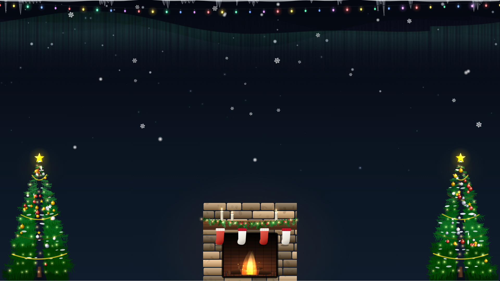
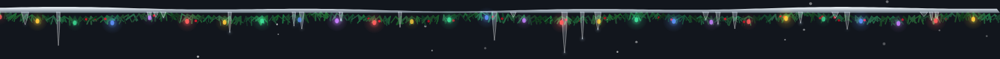
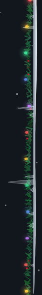
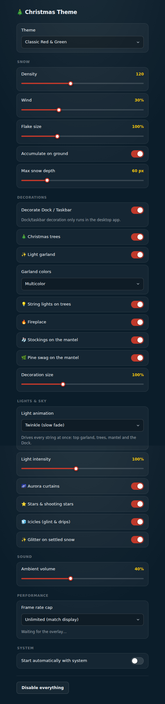

# 🎄 Christmas Theme

An open-source, free, cross-platform (macOS + Windows) desktop app that decorates your
computer for Christmas: an animated snow overlay, optional Dock/taskbar decorations, and
optional ambient sound — built on a configurable JSON theme engine instead of a single
hardcoded look.

No telemetry, no network access required, no paid "screensaver" nonsense.

See [`docs/ARCHITECTURE.md`](docs/ARCHITECTURE.md) for the full design rationale
(why Tauri over Electron, how Dock/taskbar decoration works per OS, and why the
snow overlay isn't a security risk).

## Features (V1)

- **Snow overlay**: one transparent, borderless, click-through window per connected
  monitor (multi-monitor setups get snow on every screen), with animated,
  density-configurable falling snow and optional accumulation at the bottom of the
  screen. Snowflakes render as either soft dots or faceted, gently-rotating six-branch
  crystals for visual variety. The overlay sits at the *bottom* of the window stack (like
  a live wallpaper), so it never gets in the way of using other applications — it shows
  on bare desktop space and is naturally covered by whatever window is in front.
  Changing the theme, density, or decoration toggles in the settings window updates all
  overlay windows live, with no restart needed.
- **Desktop decorations**, drawn on the overlay (one full scene per launch, not repeated
  on every monitor in a multi-monitor setup): a pine tree with ornaments and a star
  topper in each bottom corner, a twinkling light garland strung across the top of the
  screen, and an animated fireplace with a flickering flame at bottom-center. Each is an
  independent toggle in settings.
- **Animated light layers**, all toggleable and all driven by one "light animation"
  setting (twinkle / sparkle / chase / wave / steady) so the top garland, the tree
  strings, the mantel swag and the Dock all run the same show: drifting **aurora**
  curtains, a twinkling **star field** with the occasional shooting star, an **icicle
  fringe** with a glint travelling along it and meltwater drips, **glitter** flashing on
  the settled snow, flickering candles, a looping fire and rising embers. A single
  "light intensity" slider scales the lot.
- **Dock/taskbar decoration** — snow ledge, pine swag, lights and icicles along the macOS
  Dock or the Windows taskbar, on every monitor that has one. It finds the bar by
  subtracting the monitor's *work area* from its full bounds, which needs **no
  Accessibility permission and no private API on macOS**, and tracks the Dock being
  moved, resized or a monitor being plugged in. See
  [`docs/ARCHITECTURE.md`](docs/ARCHITECTURE.md#4-docktaskbar-decoration--implemented)
  and [Known limitations](#known-limitations) for the one macOS caveat.
- **JSON theme system**: versioned schema (`themes/*.json`), 8 built-in themes shipped,
  covering colors, snow density/wind/accumulation, ambient sound, and which decorations
  are active. Reusable for future seasonal themes, and extensible by dropping extra
  `*.json` files into the app's config directory under `themes/`.
- **Ambient sound**: optional fireplace crackle / sleigh bells, volume-controlled, muted by default volume choice per theme.
- **Settings window**: theme picker; snow density, wind, flake size, accumulation and max
  snow depth; dock/taskbar toggle with a **status line saying what was actually detected**;
  tree/garland/fireplace/stocking/swag toggles and decoration size; light animation,
  light intensity, aurora/stars/icicles/glitter toggles; frame-rate cap with a **live
  fps and ms-per-frame readout**; volume; autostart; and a "disable everything" button
  that removes all persisted state and takes the decorations down immediately.

## Screenshots

All four are captured by the Playwright CLI (`node scripts/dev-server.js`, then the
capture script in the commit that added them), not mocked up.

| | |
|---|---|
|  | The overlay at 1920×1080 over a dark wallpaper: aurora, star field, icicle fringe, light garland, two decorated conifers, the fireplace with lit candles, and depth-sorted snow. |
|  | The Dock/taskbar strip: snow ledge, pine swag, animated bulbs and icicles. |
|  | The same renderer with the bar docked to the left edge. |
|  | The settings window. |

## Architecture at a glance

- **Tauri v2** (Rust core + OS webview), not Electron — see
  [`docs/ARCHITECTURE.md`](docs/ARCHITECTURE.md#1-framework-choice-tauri-not-electron)
  for the size/RAM/native-API comparison that drove this.
- Three kinds of window: a small **settings** window, one full-screen transparent
  **snow overlay** per monitor (always-on-*bottom*, so it behaves like a live wallpaper
  and never covers the app you are using), and one thin click-through **dock strip** per
  monitor that has a Dock/taskbar.
- The settings and overlay UIs (`src/settings`, `src/overlay`) are plain HTML/CSS/JS with
  no Tauri-only calls in their render path (all OS calls go through `src/shared/bridge.js`,
  which falls back to `localStorage` when not running inside Tauri). This is what makes
  them testable with Playwright as ordinary web pages.

## Project layout

```
src-tauri/        Rust core: window management, theme loader, settings persistence,
                  dock/taskbar strip detection (decoration.rs), ambient audio
src/settings/     Settings window UI
src/overlay/      Snow overlay canvas renderer
                    snow.js   particles, frame budget, compositing order
                    decor.js  trees, garland, fireplace, light animation modes
                    lights.js aurora, stars, icicles, glitter
src/dock/         Dock/taskbar strip renderer
src/shared/       bridge.js — IPC-or-localStorage abstraction shared by both UIs
themes/           Built-in theme JSON files (8: classic-red, frosty-blue, minimal-white,
                  midnight-gold, candy-cane, gingerbread, arctic-aurora, santa-classic)
scripts/          dev-server.js — static file server used by Playwright + Tauri dev
tests/            Playwright test suite
docs/             Architecture notes
```

## Requirements

- Node.js 18+
- Rust toolchain (`rustup`) with `cargo`
- Tauri v2 platform prerequisites — **required even for `cargo check`**:
  - **Linux (dev only, not a target platform)**: `libwebkit2gtk-4.1-dev`, `libgtk-3-dev`,
    `libayatana-appindicator3-dev`, `librsvg2-dev`, `build-essential`. Without these,
    `cargo check`/`cargo build` fails looking for `gdk-3.0` via pkg-config.
  - **macOS**: Xcode Command Line Tools.
  - **Windows**: Microsoft C++ Build Tools + WebView2 (preinstalled on Windows 11 and most
    Windows 10 updates).
  - Full list: https://tauri.app/start/prerequisites/

## Development

```bash
npm install
npm run dev        # tauri dev — launches the real app (settings + overlay windows)
```

Run just the UI in a browser (no Tauri, no Rust build) for quick iteration:

```bash
npm run serve:ui    # http://localhost:4173  (settings at /, overlay at /overlay)
```

## Building

```bash
npm run build       # produces platform installers via `tauri build`
                     # (.dmg on macOS, .msi/.exe via nsis on Windows)
```

Build for the platform you're running on; cross-compiling installers (e.g. producing a
`.dmg` from Linux) is not supported by Tauri and isn't attempted here.

## Testing

Automated visual + interaction tests run against the settings and overlay UIs via
Playwright, served by the plain static server in `scripts/dev-server.js` (no Tauri/Rust
build required):

```bash
npx playwright install chromium   # one-time browser download
npm test                          # runs tests/*.spec.js
npm run test:update-baselines     # regenerate screenshot baselines after an
                                   # intentional visual change
```

Test files:
- `tests/settings.spec.js` — control interaction (theme select, sliders, toggles, disable button).
- `tests/visual-regression.spec.js` — screenshot baselines for the settings window across
  theme/density states (`tests/screenshots/`).
- `tests/overlay.spec.js` — the snow canvas renderer in isolation (particle count, density
  changes, that it actually draws pixels).

If you already have a Chromium binary on your machine (e.g. one Playwright previously
installed, or your system's own) and don't want to (re)download one, point
`PW_CHROMIUM_PATH` at it and `playwright.config.js` will launch that instead:

```bash
PW_CHROMIUM_PATH=/path/to/chrome npm test
```

### Settings window baselines

Generated with `npm run test:update-baselines` (Playwright CLI, Chromium):

| Default theme | Frosty Blue theme |
|---|---|
|  |  |

| Snow density: max (300) | Snow density: min (0) |
|---|---|
|  |  |

### Why the full overlay window isn't in the automated suite

The production snow overlay is a native, transparent, always-on-bottom, click-through OS
window created by Tauri. Playwright drives a browser page, not an arbitrary native OS
window, so it cannot assert on those OS-level properties (z-order, click-through,
spanning multiple monitors). What's covered instead: `src/overlay/snow.js`
has no Tauri-only calls, so it's served standalone and tested for actual rendering
behavior (particle count, live density changes, that pixels are actually drawn). The
native-window properties are verified manually per-OS — see the checklist below.

**Manual QA checklist (per OS, before each release):**
- [ ] Overlay spans the full virtual desktop across multiple monitors.
- [ ] Overlay stays on top of other windows and doesn't intercept clicks.
- [ ] Overlay survives display sleep/wake and resolution changes.
- [ ] Windows taskbar decoration tracks the taskbar after moving it to another edge,
      resizing it, and switching auto-hide on and off.
- [ ] macOS Dock decoration lines up after moving the Dock left/right/bottom and after
      using the Dock size slider, and the settings status line is accurate.
- [ ] Dock decoration appears on each monitor that has a bar, and on none that doesn't.
- [ ] The real Dock/taskbar still receives every click while decorated.

### Note on this repository's own CI/sandbox environment

The full `tests/*.spec.js` suite (31 tests: settings interaction, overlay rendering and
frame budget, dock strip rendering, and 4 visual baselines) was run
and passes in the sandboxed Linux container this scaffold was built in, using its
pre-installed Chromium via `PW_CHROMIUM_PATH` (that sandbox has no outbound access to
`cdn.playwright.dev`, so `playwright install`'s own browser download doesn't work there —
not a code issue, just that container's network policy). After installing the Linux Tauri
prerequisites (`libwebkit2gtk-4.1-dev`, `libgtk-3-dev`, `libayatana-appindicator3-dev`,
`librsvg2-dev`, `libasound2-dev`, `build-essential`), the Rust/Tauri core was also compiled
and run end-to-end there (`cargo check`, `npm run dev` under `xvfb-run`) with both the
settings and overlay windows launching successfully.

## App icons

No app icon is committed yet (`src-tauri/tauri.conf.json` has no `bundle.icon` entry, so
`tauri build` uses Tauri's default icon). Add real icons with `tauri icon path/to/1024.png`
before shipping a release build, then add the generated `icons/` paths back into
`bundle.icon` in `tauri.conf.json`.

## Known limitations

- **macOS: the decoration hangs over the Dock's edge, it does not cover the Dock.**
  The Dock is composited above ordinary floating windows, so no normal window can be
  drawn on top of it. The strip window therefore reaches 26 px out of the shell bar onto
  the desktop, and that band carries the snow ledge, the garland and the icicle roots.
  On Windows the taskbar is covered directly. This is a platform constraint, not
  something the app can configure away.
- **macOS with the Dock set to auto-hide**: it reserves no work area and exposes no
  public API for its hidden frame, so no strip is detected and nothing is drawn. The
  settings window says so under the toggle instead of leaving it looking broken.
- The macOS- and Windows-specific code paths in this project (work-area subtraction
  against a real Dock/taskbar, the `Shell_TrayWnd` fallback, `macOSPrivateApi`/
  transparent-window behavior, always-on-top strip placement) have
  only been compiled and logic-reviewed in a Linux sandbox, never run on a real Mac or
  PC by the person making these changes — real hardware testing on both macOS and Windows by
  someone with access to those machines is still needed before relying on this for a
  release.

## Fixed in review (worth knowing if something still looks off)

A pass after the initial scaffold found and fixed several bugs that, together, made the
app look far less finished than intended:

- **`window.__TAURI__` was never injected.** `app.withGlobalTauri` wasn't set in
  `tauri.conf.json`, so `src/shared/bridge.js`'s Tauri-detection check was always false —
  the whole app was silently running in its "not in Tauri" `localStorage`/`fetch` fallback
  mode, meaning the settings window never actually talked to the Rust backend at all. This
  alone explains most of "nothing works": themes, decorations, persistence.
- **Only one theme ever showed up.** `list_themes` read from `app.path().resource_dir()`,
  but `tauri.conf.json` never declared `themes/` as a bundled resource, so that directory
  was always empty and the app silently fell back to a single hardcoded theme. Themes are
  now embedded into the binary at compile time (`include_str!`), so this can't happen
  regardless of bundle/resource configuration — and there are 8 built-in themes now
  instead of 3.
- **The overlay blocked all clicks, including on the settings window.** The snow window
  was always-on-top and covered the whole screen but was never told to ignore cursor
  events, so it silently ate every click both on the desktop and on the app's own settings
  window sitting underneath it. `set_ignore_cursor_events(true)` is now called on every
  overlay window at creation.
- **Snow only ever appeared on one monitor**, and changing the theme or snow density in
  settings did nothing to what was already on screen. The overlay is now one window per
  monitor (`available_monitors()`), and the backend emits a `settings-changed` event on
  every save that all overlay windows listen for and apply immediately — see
  `spawn_overlay_windows` and `save_settings` in `src-tauri/src/main.rs`.
- **No `capabilities/` file existed at all**, which in Tauri v2 means every window is
  denied *every* IPC call by default — not just restricted, completely blocked, themes
  and settings included. This is a separate issue from the `withGlobalTauri` one above:
  even once the frontend could reach the IPC layer, the IPC layer itself had nothing
  granting it permission to go through. Added `src-tauri/capabilities/default.json`
  granting the settings window and every `overlay-*` window `core:default` (covers
  event listening, window control, and the app's own commands).
- **The overlay was `always_on_top`, floating above every other application** —
  the opposite of what a desktop decoration should do, and the direct cause of it
  getting in the way of using other apps. Changed to `always_on_bottom` (like a live
  wallpaper: visible on empty desktop space, naturally covered by whatever window
  you're using) and removed `visible_on_all_workspaces`, so it no longer follows you
  into another virtual desktop or over a fullscreen app either.

## Added since (visual pass)

- **Nicer snowflakes**: about a third of flakes now render as faceted, gently-rotating
  six-branch crystal outlines (`drawFlake` in `src/overlay/snow.js`) instead of every
  flake being a plain soft dot.
- **Desktop decorations**: `src/overlay/decor.js` adds a twinkling light garland
  (`drawGarland`), a pine tree with ornaments and a star topper in each bottom corner
  (`drawTrees`), and an animated fireplace with a flickering flame (`drawFireplace`).
  Each has its own settings toggle (`treesDecoration`, `garlandsDecoration`,
  `fireplaceDecoration` in `AppSettings`) and only renders on one overlay window
  (`overlay-0`, checked via `window.__TAURI__.window.getCurrentWindow().label`) so a
  multi-monitor setup gets one decorated scene, not the same trees repeated on every
  screen.

## Added since (realism + more settings pass)

- **More realistic rendering, without extra CPU/GPU cost**: soft-dot snowflakes now use a
  pre-rendered glow sprite (`drawImage`) instead of a live `ctx.shadowBlur` per flake per
  frame — shadowBlur at that scale is a well-known canvas performance trap, which would
  have worked against this project's own "stay light" requirement. Trees get gradient-
  shaded foliage tiers and a soft contact shadow instead of flat silhouettes; the
  fireplace flame uses radial gradients (hot pale core fading to a deeper edge) and sits
  above a couple of drawn logs instead of a flat-colored teardrop; garland bulbs are
  small shaded ellipses with a highlight and a cap instead of plain dots; the snow pile
  gets a faint bluish ridge line for a hint of depth.
- **More settings**: a wind slider (`snowWind`, overrides the theme's own wind default,
  same pattern as density), a ground-accumulation on/off toggle (`snowAccumulate`), and a
  garland color palette picker (`garlandStyle`: multicolor / warm white / cool blue —
  `GARLAND_PALETTES` in `src/overlay/decor.js`). All live-sync to the overlay the same
  way density and theme already did.

## Added since (realism + modern UI pass)

- **Depth-of-field snow**: every flake now carries a `depth`, and its size, speed, wind
  response, brightness and sprite softness all follow from it. Distant flakes stay small,
  slow, dim and crisp; near ones are large, fast and bloom out of focus. The scene is
  composited in depth order — distant snow behind the trees and fireplace, near snow in
  front — which is what gives the overlay a sense of volume instead of one flat sheet.
  Crystals gained a second pair of side branches so the silhouette reads as a dendrite
  rather than an asterisk.
- **Rebuilt decorations** (`src/overlay/decor.js`): pines now have a needled silhouette
  with light-direction shading, bark grain, ambient occlusion between boughs, snow laid
  along the branch tips, ornaments with specular highlights and a star with a bloom. The
  fireplace has per-stone tonal variation with bevels and mortar, a timber mantel with
  grain, a recessed sooty hearth, charred logs, and a live fire built from seven additive
  flame tongues, an ember bed, rising sparks and warm light spilling onto the floor.
  Garland bulbs are shaded glass teardrops with filament highlights on a catenary wire.
- **Everything static is cached**: tree sprites and the fireplace stonework are rendered
  once into offscreen canvases and blitted with a single `drawImage` per frame; only the
  fire, sparks, light spill and bulb twinkle are redrawn. That's what allows this much
  texture detail while still measuring ~60fps.
- **Modernised settings window**: card-style rows with hover states, real toggle switches,
  sliders with a filled track (`--fill`, kept in sync by `syncRangeFill`), a custom select,
  a proper type scale and grouped sections (Snow / Decorations / Sound). The controls are
  still native `<input>` elements styled with `appearance: none`, so they stay keyboard
  accessible and directly clickable by the Playwright suite.

## Added since (reference-matched scene, 120fps budget, more controls)

Rebuilt against photo references of a decorated living room and a snowy chalet.

- **Scene**: conifers are now a dense mass of individually drawn boughs (curved stems
  with needle pairs) rather than stacked triangles, carrying warm string lights, baubles
  with specular highlights, snow-laden branch tips and a glowing star. The fireplace is
  warm irregular limestone with per-stone tone and mottling, a chunky timber mantel, a
  pine swag with cones and berries draped over it, stockings hung beneath, a red firebrick
  firebox with grate and logs, and light spilling into the room.
- **120fps budget.** The renderer was restructured around it: everything static is baked
  once into offscreen canvases, the flame is a pre-rendered 36-frame loop, glows are
  reusable tinted sprites, snow crystals are a strip of pre-rotated frames, and the
  settled snow bank is its own canvas rebuilt only when a flake actually lands. The hot
  loop issues drawImage calls and creates **zero** gradients per frame. Measured at
  1920x1080: **0.57ms/frame at 120 flakes, 0.98ms at 300** — against the 8.33ms a 120fps
  frame allows, so 8-15x headroom. `tests/overlay.spec.js` asserts the frame cost stays
  under 4ms so a future change can't quietly regress it.
- **Frame rate is adjustable** (`fpsLimit`): unlimited (match the display — what a 120Hz
  ProMotion panel needs to actually run at 120), 144, 120, 60, or 30 for battery. The
  overlay publishes its measured fps and frame cost over the event bus and the settings
  window shows them live, so the number is verifiable rather than asserted.
- **More controls**: max snow depth (0-300px), flake size (40-250%), decoration size
  (50-200%), string lights on trees, stockings, mantel swag — alongside the existing
  density, wind, accumulation and garland palette.

## Contributing

Issues and PRs welcome. Please:
1. Keep new theme JSON files under `themes/`, following the existing schema
   (`schemaVersion: 1`).
2. Run `npm test` before submitting UI changes, and update screenshot baselines
   intentionally (`npm run test:update-baselines`) with an explanation in the PR.
3. Keep `src/settings` and `src/overlay` free of Tauri-only APIs outside
   `src/shared/bridge.js`, so they stay Playwright-testable as plain web pages.

## License

MIT — see [`LICENSE`](LICENSE).
