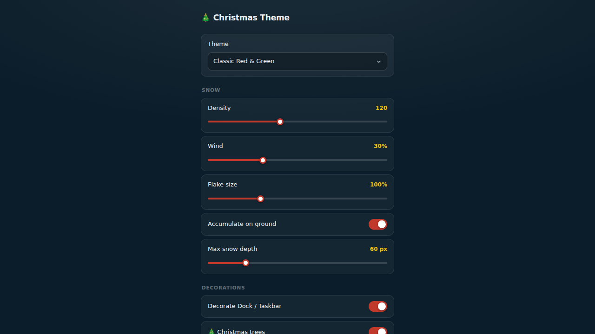
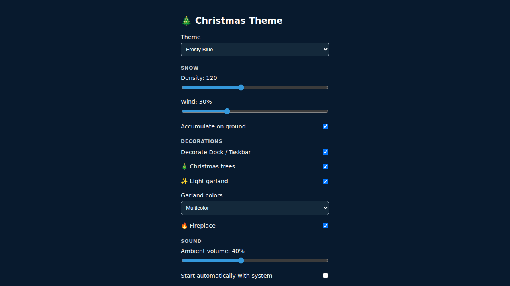
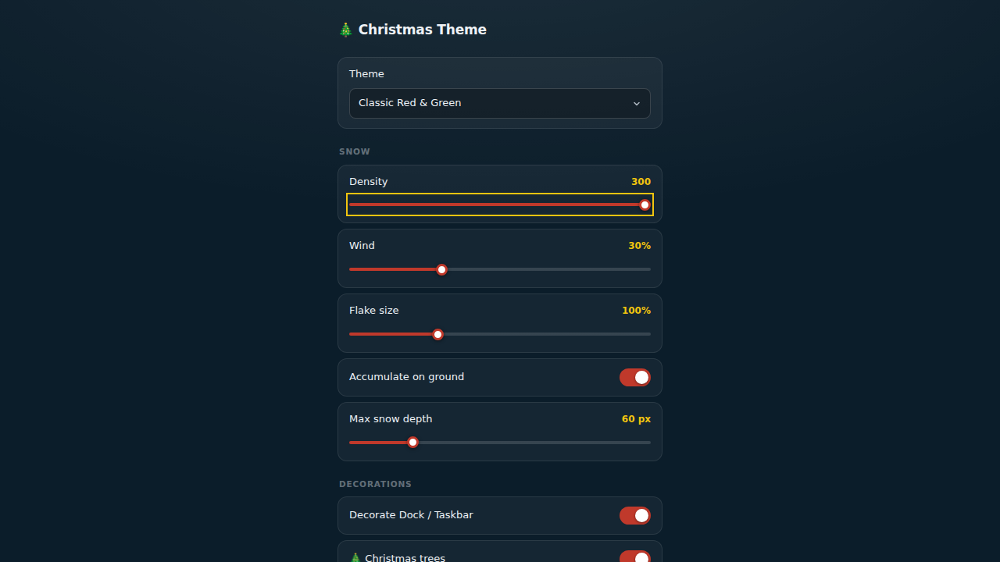
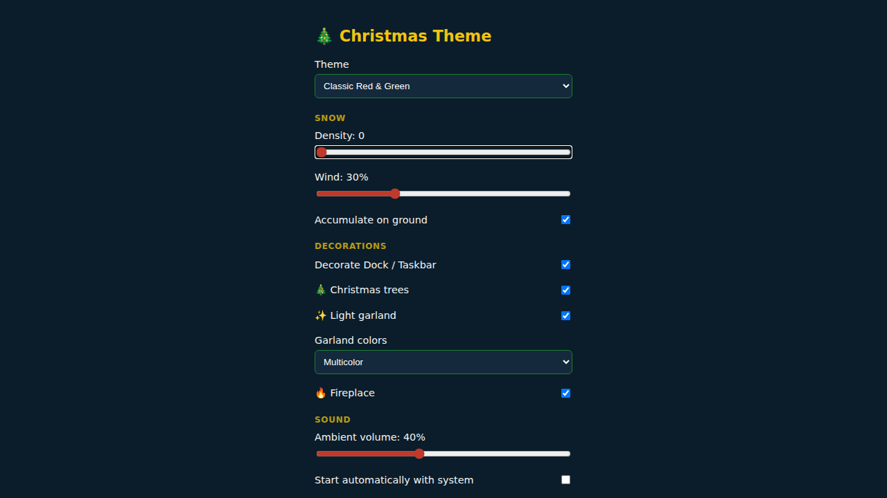

# 🎄 Christmas Theme

An open-source, free, cross-platform (macOS + Windows) desktop app that decorates your
computer for Christmas: an animated snow overlay, optional Dock/taskbar decorations, and
optional ambient sound — built on a configurable JSON theme engine instead of a single
hardcoded look.

No telemetry, no network access required, no paid "screensaver" nonsense.

See [`docs/ARCHITECTURE.md`](docs/ARCHITECTURE.md) for the full design rationale
(why Tauri over Electron, how Dock/taskbar decoration works per OS, and why the
snow overlay isn't a security risk).

## Features (V1)

- **Snow overlay**: one transparent, borderless, always-on-top, click-through window per
  connected monitor (multi-monitor setups get snow on every screen), with animated,
  density-configurable falling snow and optional accumulation at the bottom of the screen.
  Changing the theme or density in the settings window updates all overlay windows live.
- **Dock/taskbar decoration**: **not implemented yet** — the toggle exists in settings and
  is persisted, but nothing currently draws on the Dock or taskbar. See
  [Known limitations](#known-limitations) for the plan and why this is harder than it looks,
  especially on macOS.
- **JSON theme system**: versioned schema (`themes/*.json`), 8 built-in themes shipped,
  covering colors, snow density/wind/accumulation, ambient sound, and which decorations
  are active. Reusable for future seasonal themes, and extensible by dropping extra
  `*.json` files into the app's config directory under `themes/`.
- **Ambient sound**: optional fireplace crackle / sleigh bells, volume-controlled, muted by default volume choice per theme.
- **Settings window**: theme picker, snow density slider, dock/taskbar toggle, volume
  slider, autostart toggle, and a "disable everything" button that removes all
  persisted state.

## Architecture at a glance

- **Tauri v2** (Rust core + OS webview), not Electron — see
  [`docs/ARCHITECTURE.md`](docs/ARCHITECTURE.md#1-framework-choice-tauri-not-electron)
  for the size/RAM/native-API comparison that drove this.
- Two windows: a small **settings** window and a full-screen transparent **overlay**
  window for snow.
- The settings and overlay UIs (`src/settings`, `src/overlay`) are plain HTML/CSS/JS with
  no Tauri-only calls in their render path (all OS calls go through `src/shared/bridge.js`,
  which falls back to `localStorage` when not running inside Tauri). This is what makes
  them testable with Playwright as ordinary web pages.

## Project layout

```
src-tauri/        Rust core: window management, theme loader, settings persistence,
                  platform-specific dock/taskbar decoration, ambient audio
src/settings/     Settings window UI
src/overlay/      Snow overlay canvas renderer
src/shared/       bridge.js — IPC-or-localStorage abstraction shared by both UIs
themes/           Built-in theme JSON files (8: classic-red, frosty-blue, minimal-white,
                  midnight-gold, candy-cane, gingerbread, arctic-aurora, santa-classic)
scripts/          dev-server.js — static file server used by Playwright + Tauri dev
tests/            Playwright test suite
docs/             Architecture notes
```

## Requirements

- Node.js 18+
- Rust toolchain (`rustup`) with `cargo`
- Tauri v2 platform prerequisites — **required even for `cargo check`**:
  - **Linux (dev only, not a target platform)**: `libwebkit2gtk-4.1-dev`, `libgtk-3-dev`,
    `libayatana-appindicator3-dev`, `librsvg2-dev`, `build-essential`. Without these,
    `cargo check`/`cargo build` fails looking for `gdk-3.0` via pkg-config.
  - **macOS**: Xcode Command Line Tools.
  - **Windows**: Microsoft C++ Build Tools + WebView2 (preinstalled on Windows 11 and most
    Windows 10 updates).
  - Full list: https://tauri.app/start/prerequisites/

## Development

```bash
npm install
npm run dev        # tauri dev — launches the real app (settings + overlay windows)
```

Run just the UI in a browser (no Tauri, no Rust build) for quick iteration:

```bash
npm run serve:ui    # http://localhost:4173  (settings at /, overlay at /overlay)
```

## Building

```bash
npm run build       # produces platform installers via `tauri build`
                     # (.dmg on macOS, .msi/.exe via nsis on Windows)
```

Build for the platform you're running on; cross-compiling installers (e.g. producing a
`.dmg` from Linux) is not supported by Tauri and isn't attempted here.

## Testing

Automated visual + interaction tests run against the settings and overlay UIs via
Playwright, served by the plain static server in `scripts/dev-server.js` (no Tauri/Rust
build required):

```bash
npx playwright install chromium   # one-time browser download
npm test                          # runs tests/*.spec.js
npm run test:update-baselines     # regenerate screenshot baselines after an
                                   # intentional visual change
```

Test files:
- `tests/settings.spec.js` — control interaction (theme select, sliders, toggles, disable button).
- `tests/visual-regression.spec.js` — screenshot baselines for the settings window across
  theme/density states (`tests/screenshots/`).
- `tests/overlay.spec.js` — the snow canvas renderer in isolation (particle count, density
  changes, that it actually draws pixels).

If you already have a Chromium binary on your machine (e.g. one Playwright previously
installed, or your system's own) and don't want to (re)download one, point
`PW_CHROMIUM_PATH` at it and `playwright.config.js` will launch that instead:

```bash
PW_CHROMIUM_PATH=/path/to/chrome npm test
```

### Settings window baselines

Generated with `npm run test:update-baselines` (Playwright CLI, Chromium):

| Default theme | Frosty Blue theme |
|---|---|
|  |  |

| Snow density: max (300) | Snow density: min (0) |
|---|---|
|  |  |

### Why the full overlay window isn't in the automated suite

The production snow overlay is a native, transparent, always-on-top, click-through OS
window created by Tauri. Playwright drives a browser page, not an arbitrary native OS
window, so it cannot assert on those OS-level properties (always-on-top ordering,
click-through, spanning multiple monitors). What's covered instead: `src/overlay/snow.js`
has no Tauri-only calls, so it's served standalone and tested for actual rendering
behavior (particle count, live density changes, that pixels are actually drawn). The
native-window properties are verified manually per-OS — see the checklist below.

**Manual QA checklist (per OS, before each release):**
- [ ] Overlay spans the full virtual desktop across multiple monitors.
- [ ] Overlay stays on top of other windows and doesn't intercept clicks.
- [ ] Overlay survives display sleep/wake and resolution changes.
- [ ] Windows taskbar decoration tracks taskbar position after moving/resizing it.
- [ ] macOS Dock decoration (if enabled) behaves reasonably after Dock resize/auto-hide,
      and the Accessibility permission prompt is clear.

### Note on this repository's own CI/sandbox environment

The full `tests/*.spec.js` suite (9 interaction tests + 4 visual baselines above) was run
and passes in the sandboxed Linux container this scaffold was built in, using its
pre-installed Chromium via `PW_CHROMIUM_PATH` (that sandbox has no outbound access to
`cdn.playwright.dev`, so `playwright install`'s own browser download doesn't work there —
not a code issue, just that container's network policy). After installing the Linux Tauri
prerequisites (`libwebkit2gtk-4.1-dev`, `libgtk-3-dev`, `libayatana-appindicator3-dev`,
`librsvg2-dev`, `libasound2-dev`, `build-essential`), the Rust/Tauri core was also compiled
and run end-to-end there (`cargo check`, `npm run dev` under `xvfb-run`) with both the
settings and overlay windows launching successfully.

## App icons

No app icon is committed yet (`src-tauri/tauri.conf.json` has no `bundle.icon` entry, so
`tauri build` uses Tauri's default icon). Add real icons with `tauri icon path/to/1024.png`
before shipping a release build, then add the generated `icons/` paths back into
`bundle.icon` in `tauri.conf.json`.

## Known limitations

- **Dock/taskbar decoration is not implemented yet**, on either OS. `src-tauri/src/decoration.rs`
  has the low-level lookups (`windows_impl::taskbar_rect()` for Windows'
  `Shell_TrayWnd`; a macOS `dock_frame()` stub) but neither is wired up to actually
  create and position a decoration window yet — the settings toggle is honest about
  this (it's just not connected to anything). See
  [`docs/ARCHITECTURE.md`](docs/ARCHITECTURE.md#4-docktaskbar-decoration--feasibility)
  for the design and why macOS in particular is harder: there's no public, stable API
  for the Dock's exact screen position, only the Accessibility API, which requires the
  user to grant Accessibility permission and can lag behind Dock resize/move/auto-hide
  since it would have to poll rather than subscribe to a change notification.
- The macOS-specific code paths in this project (`decoration.rs`'s `macos_impl`,
  the Accessibility-permission flow, `macOSPrivateApi`/transparent-window behavior) have
  only been compiled and logic-reviewed in a Linux sandbox, never run on a real Mac by
  the person making these changes — real hardware testing on both macOS and Windows by
  someone with access to those machines is still needed before relying on this for a
  release.

## Fixed in review (worth knowing if something still looks off)

A pass after the initial scaffold found and fixed several bugs that, together, made the
app look far less finished than intended:

- **`window.__TAURI__` was never injected.** `app.withGlobalTauri` wasn't set in
  `tauri.conf.json`, so `src/shared/bridge.js`'s Tauri-detection check was always false —
  the whole app was silently running in its "not in Tauri" `localStorage`/`fetch` fallback
  mode, meaning the settings window never actually talked to the Rust backend at all. This
  alone explains most of "nothing works": themes, decorations, persistence.
- **Only one theme ever showed up.** `list_themes` read from `app.path().resource_dir()`,
  but `tauri.conf.json` never declared `themes/` as a bundled resource, so that directory
  was always empty and the app silently fell back to a single hardcoded theme. Themes are
  now embedded into the binary at compile time (`include_str!`), so this can't happen
  regardless of bundle/resource configuration — and there are 8 built-in themes now
  instead of 3.
- **The overlay blocked all clicks, including on the settings window.** The snow window
  was always-on-top and covered the whole screen but was never told to ignore cursor
  events, so it silently ate every click both on the desktop and on the app's own settings
  window sitting underneath it. `set_ignore_cursor_events(true)` is now called on every
  overlay window at creation.
- **Snow only ever appeared on one monitor**, and changing the theme or snow density in
  settings did nothing to what was already on screen. The overlay is now one window per
  monitor (`available_monitors()`), and the backend emits a `settings-changed` event on
  every save that all overlay windows listen for and apply immediately — see
  `spawn_overlay_windows` and `save_settings` in `src-tauri/src/main.rs`.
- **No `capabilities/` file existed at all**, which in Tauri v2 means every window is
  denied *every* IPC call by default — not just restricted, completely blocked, themes
  and settings included. This is a separate issue from the `withGlobalTauri` one above:
  even once the frontend could reach the IPC layer, the IPC layer itself had nothing
  granting it permission to go through. Added `src-tauri/capabilities/default.json`
  granting the settings window and every `overlay-*` window `core:default` (covers
  event listening, window control, and the app's own commands).
- **The overlay was `always_on_top`, floating above every other application** —
  the opposite of what a desktop decoration should do, and the direct cause of it
  getting in the way of using other apps. Changed to `always_on_bottom` (like a live
  wallpaper: visible on empty desktop space, naturally covered by whatever window
  you're using) and removed `visible_on_all_workspaces`, so it no longer follows you
  into another virtual desktop or over a fullscreen app either.

## Contributing

Issues and PRs welcome. Please:
1. Keep new theme JSON files under `themes/`, following the existing schema
   (`schemaVersion: 1`).
2. Run `npm test` before submitting UI changes, and update screenshot baselines
   intentionally (`npm run test:update-baselines`) with an explanation in the PR.
3. Keep `src/settings` and `src/overlay` free of Tauri-only APIs outside
   `src/shared/bridge.js`, so they stay Playwright-testable as plain web pages.

## License

MIT — see [`LICENSE`](LICENSE).
